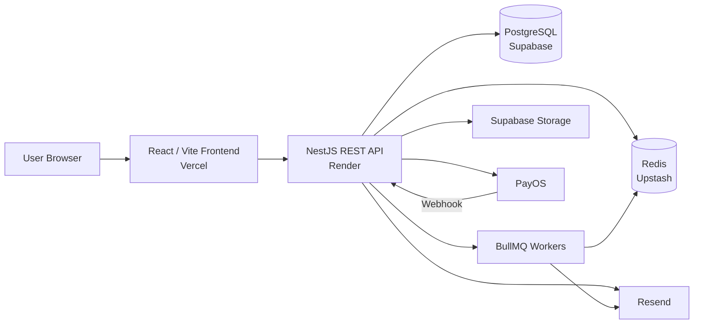

# E-commerce Platform

[](https://github.com/thanhsonls12/EcommerceAPI/actions/workflows/ci.yml)

A full-stack e-commerce project built to demonstrate production-oriented backend engineering with NestJS, PostgreSQL, Redis, queues, payments, object storage, CI/CD, and a modern React storefront/admin interface.

The project covers the complete commerce flow from authentication and product discovery to cart management, checkout, payment processing, inventory updates, reviews, and administration.

**Primary focus:** backend architecture, security, data consistency, asynchronous processing, payment integration, testing, and production deployment.

## Live Services

| Service          | URL                                              |
| ---------------- | ------------------------------------------------ |
| Storefront       | https://shop.sonkma.id.vn                        |
| REST API         | https://ecommerce-api.sonkma.id.vn/api           |
| Swagger API Docs | https://ecommerce-api.sonkma.id.vn/api/docs      |

> The API is hosted on Render's free tier, so the first request after a period of inactivity may take longer while the service wakes up.

## Highlights

- JWT authentication with refresh-token rotation and device/session tracking
- Email verification, password recovery, TOTP two-factor authentication, and recovery codes
- Role-based access control with granular permissions
- Product catalog with brands, categories, translations, variants, SKUs, stock, media, highlights, and specifications
- Search, filtering, sorting, and pagination
- Guest cart with authenticated cart reconciliation after login
- Address management and checkout flow
- Promotions and coupon usage controls
- Order lifecycle and SKU snapshots
- PayOS payment integration with signed webhook handling
- Inventory transaction history, restocking, and manual adjustments
- Product reviews with media uploads
- Supabase Storage integration for product/review media
- Redis-backed caching, throttling support, and BullMQ queues
- Realtime/WebSocket infrastructure and notifications
- Structured logging, health checks, metrics, and optional Sentry integration
- Dockerized local/production-style environment
- Unit, HTTP integration, and end-to-end tests
- GitHub Actions CI for linting, builds, tests, migration validation, and dependency auditing
- React/Vite storefront and admin dashboard

## Tech Stack

### Backend

| Area              | Technology                          |
| ----------------- | ----------------------------------- |
| Runtime           | Node.js 24                          |
| Framework         | NestJS 11                           |
| Language          | TypeScript                          |
| Database          | PostgreSQL                          |
| ORM               | Prisma 7                            |
| Cache             | Redis                               |
| Queue             | BullMQ + ioredis                    |
| Authentication    | JWT, bcrypt, TOTP                   |
| Validation        | Zod + nestjs-zod                    |
| API documentation | Swagger / OpenAPI                   |
| Payments          | PayOS                               |
| Email             | Resend                              |
| Object storage    | Supabase Storage                    |
| Logging           | Pino / nestjs-pino                  |
| Monitoring        | Prometheus metrics, optional Sentry |
| Testing           | Jest + Supertest                    |

### Frontend

| Area         | Technology                   |
| ------------ | ---------------------------- |
| UI           | React 19                     |
| Build tool   | Vite 8                       |
| Language     | TypeScript                   |
| Styling      | Tailwind CSS 4 + project CSS |
| Routing      | React Router                 |
| Server state | TanStack Query               |
| Forms        | React Hook Form + Zod        |
| Icons        | Lucide React                 |

### Infrastructure

| Component             | Service                 |
| --------------------- | ----------------------- |
| API hosting           | Render                  |
| Frontend hosting      | Vercel                  |
| Production PostgreSQL | Supabase                |
| Production Redis      | Upstash                 |
| Media storage         | Supabase Storage        |
| CI/CD                 | GitHub Actions          |
| Containers            | Docker / Docker Compose |

## Architecture



The backend is organized into domain-oriented modules under `src/routes`. Business logic is kept in services, persistence is isolated behind repositories where appropriate, and cross-cutting concerns such as configuration, storage, logging, caching, queues, guards, and interceptors live in shared infrastructure.

## Core Modules

```text
src/routes/
├── address
├── auth
├── brand
├── cart
├── category
├── device
├── inventory
├── notification
├── order
├── payment
├── product
├── promotion
├── realtime
├── recovery-code
├── refresh-token
├── review
├── user
└── verification-code
```

## Authentication & Security

The authentication flow is designed around short-lived access tokens and persisted refresh-token sessions.

Key security mechanisms include:

- Password hashing with bcrypt
- Access and refresh JWTs with separate secrets and lifetimes
- Refresh-token hashes stored server-side instead of raw refresh tokens
- Device/session tracking for login and logout flows
- Email verification codes
- Password reset codes
- TOTP-based two-factor authentication
- Recovery codes for 2FA recovery
- Role and permission guards
- Request throttling
- Helmet security headers
- Configurable CORS allowlist
- Request body size limits
- Production dependency auditing

## Commerce Flow


Orders preserve product/SKU snapshot data so historical purchases remain consistent even if catalog data changes later.

## Inventory

Inventory is tracked at SKU level. Stock-changing operations create inventory transactions containing values such as:

- transaction type
- quantity
- stock before
- stock after
- operator
- timestamp
- optional note

The admin interface can inspect low-stock SKUs, restock inventory, perform adjustments, and view inventory history.

## Payments

PayOS is used for hosted checkout.

The backend:

1. Creates the payment request from an existing order.
2. Redirects the customer to the PayOS checkout page.
3. Receives the PayOS webhook on the backend.
4. Verifies webhook authenticity before applying state changes.
5. Reconciles payment and order state.
6. Exposes separate frontend return/cancel URLs for browser navigation.

Production webhook endpoint:

```text
POST https://ecommerce-api.sonkma.id.vn/api/payments/webhook
```

## Product Media

Product and review image uploads are handled by the backend and stored in Supabase Storage. Database records keep the public URL and, when applicable, the storage key used for deletion or lifecycle management.

The seed catalog currently supports demo image URLs. Real product assets can be uploaded through the admin/API media flow without exposing Supabase server credentials to the frontend.

## Project Structure

```text
.
├── .github/workflows/       # CI pipeline
├── frontend/                # React/Vite storefront + admin UI
├── generated/               # Generated Prisma client
├── prisma/
│   ├── migrations/          # Database migrations
│   ├── schema.prisma        # Database schema
│   └── seed.ts              # Demo/portfolio seed data
├── scripts/                 # Operational scripts
├── src/
│   ├── routes/              # Domain modules
│   ├── shared/              # Shared infrastructure/services/config
│   ├── app.module.ts
│   └── main.ts
├── test/                    # HTTP integration + E2E tests
├── docker-compose.yml
├── Dockerfile
├── render.yaml
└── README.md
```

## Local Development

### Prerequisites

- Node.js 24+
- npm
- Docker Desktop / Docker Engine
- Git

### 1. Clone the repository

```bash
git clone git@github.com:thanhsonls12/EcommerceAPI.git
cd EcommerceAPI
```

### 2. Install backend dependencies

```bash
npm install
```

### 3. Configure environment variables

Copy the template:

```bash
cp .env.example .env
```

On Windows PowerShell:

```powershell
Copy-Item .env.example .env
```

Generate your own secrets and configure external integrations before using shared or production environments. Never commit `.env`.

Important backend variables include:

```text
DATABASE_URL
DIRECT_URL
REDIS_URL
ACCESS_TOKEN_SECRET
REFRESH_TOKEN_SECRET
TWO_FACTOR_TOKEN_SECRET
VERIFICATION_CODE_SECRET
API_SECRET_KEY
RESEND_API_KEY
EMAIL_FROM
PAYOS_CLIENT_ID
PAYOS_API_KEY
PAYOS_CHECKSUM_KEY
PAYOS_RETURN_URL
PAYOS_CANCEL_URL
SUPABASE_URL
SUPABASE_SECRET_KEY
SUPABASE_STORAGE_BUCKET
CORS_ORIGIN
```

See `.env.example` for the complete configuration contract.

### 4. Start PostgreSQL and Redis

For local infrastructure only:

```bash
docker compose up -d postgres redis
```

The default local ports are:

```text
PostgreSQL: localhost:5433
Redis:      localhost:6379
```

### 5. Apply migrations

```bash
npm run db:migrate:deploy
```

For development migration authoring, use:

```bash
npm run db:migrate:dev
```

### 6. Seed demo data

```bash
npm run db:seed
```

The seed creates representative roles, permissions, users, brands, categories, products, variants/SKUs, inventory, promotions, addresses, cart/order data, notifications, and related demo records.

### 7. Start the backend

```bash
npm run start:dev
```

Default local API:

```text
http://localhost:3000/api
```

Swagger:

```text
http://localhost:3000/api/docs
```

## Frontend Development

Install frontend dependencies:

```bash
cd frontend
npm install
```

Create the frontend environment file from `frontend/.env.example` and configure:

```env
VITE_API_URL=http://localhost:3000/api
```

Run the development server:

```bash
npm run dev
```

The default Vite URL is typically:

```text
http://localhost:5173
```

## Docker

To run the production-style backend stack locally:

```bash
docker compose up --build -d
```

The Compose stack includes:

- PostgreSQL
- Redis
- one-shot Prisma migration service
- NestJS API

The API waits for healthy dependencies and completed migrations before starting.

Stop the stack with:

```bash
docker compose down
```

To also delete the local PostgreSQL volume:

```bash
docker compose down -v
```

## Database Commands

```bash
# Apply existing migrations
npm run db:migrate:deploy

# Create/apply development migrations
npm run db:migrate:dev

# Check migration status
npm run db:migrate:status

# Seed data
npm run db:seed
```

Production migrations should use a direct or session-compatible PostgreSQL connection rather than a transaction-pooling connection when the provider requires it.

## Testing & Quality Gates

Backend:

```bash
# Unit tests
npm test

# HTTP integration tests
npm run test:http

# End-to-end tests
npm run test:e2e

# Lint
npm run lint:check

# Build
npm run build

# Production dependency audit
npm run audit:prod
```

Frontend:

```bash
npm run build --prefix frontend
npm run lint:check --prefix frontend
npm run format:check --prefix frontend
```

## CI Pipeline

GitHub Actions runs on pushes to `main` and pull requests.

The current pipeline validates:

```text
quality
├── npm ci
├── Prisma client generation
├── lint
├── backend build
├── unit tests
├── HTTP integration tests
└── production dependency audit

migrations
├── disposable PostgreSQL service
├── prisma migrate deploy
└── migration status verification

e2e
├── disposable PostgreSQL service
├── disposable Redis service
└── end-to-end tests
```

Render is configured to auto-deploy the API after the required checks pass.

## Health Checks

The application separates process health from dependency readiness:

```text
GET /api/health/live
GET /api/health/ready
```

- `live` answers whether the API process is alive.
- `ready` verifies whether dependencies required to serve traffic, such as PostgreSQL and Redis, are available.

This distinction is useful for container orchestration and production deployment health checks.

## Deployment

### Backend

The production API is deployed on Render from `render.yaml` using the multi-stage Dockerfile.

Production dependencies:

```text
API          -> Render
PostgreSQL   -> Supabase
Redis        -> Upstash
Storage      -> Supabase Storage
Email        -> Resend
Payments     -> PayOS
```

### Frontend

The Vite frontend is designed for Vercel deployment with:

```text
Root Directory: frontend
Build Command:  npm run build
Output:         dist
```

Required frontend environment variable:

```env
VITE_API_URL=https://ecommerce-api.sonkma.id.vn/api
```

Production storefront:

```text
https://shop.sonkma.id.vn
```

The backend must allow the deployed storefront origin and use the storefront for PayOS browser redirects:

```text
CORS_ORIGIN=https://shop.sonkma.id.vn
PAYOS_RETURN_URL=https://shop.sonkma.id.vn/payment/success
PAYOS_CANCEL_URL=https://shop.sonkma.id.vn/payment/cancel
```

## API Documentation

Interactive Swagger documentation is available at:

https://ecommerce-api.sonkma.id.vn/api/docs

The API uses the `/api` global prefix. Protected endpoints accept Bearer access tokens through the `Authorization` header.

## Design Decisions Worth Discussing

This project intentionally includes several engineering concerns that commonly appear in real backend systems and technical interviews:

- **Refresh-token sessions:** separate short-lived access tokens from longer-lived authenticated sessions.
- **Device tracking:** enables per-device session lifecycle and logout behavior.
- **Repository abstraction:** keeps persistence concerns separate from business rules in domains where it improves maintainability and testability.
- **SKU-level inventory:** stock belongs to purchasable variants rather than only to the product aggregate.
- **Order snapshots:** historical order data is protected from later catalog changes.
- **Inventory transactions:** stock mutations retain an auditable before/after history.
- **Webhook verification and idempotent processing:** external payment callbacks are treated as untrusted/retryable input.
- **Queues:** asynchronous work can be moved away from latency-sensitive request paths.
- **Redis caching:** reduces repeated reads for hot catalog data while explicit invalidation protects consistency.
- **Readiness vs. liveness:** infrastructure can distinguish a running process from an instance that is actually ready to serve requests.
- **Migration validation in CI:** database changes are tested against a clean PostgreSQL instance before deployment.

## Security Notes

- Never commit `.env` files or real API credentials.
- Server-side credentials such as `SUPABASE_SECRET_KEY`, PayOS secrets, database URLs, and Resend API keys must never be exposed through `VITE_*` variables.
- Use unique production secrets instead of the example values from `.env.example`.
- Restrict `CORS_ORIGIN` to known frontend origins.
- Rotate credentials immediately if they are accidentally disclosed.

## Repository Status

The project is feature-complete for its current portfolio scope. Future improvements can focus on performance tuning, richer product media workflows, additional frontend automated tests, and deeper observability rather than expanding the core commerce feature set.

---

Built as a backend-focused portfolio project demonstrating end-to-end e-commerce architecture, production deployment, and operational concerns beyond basic CRUD APIs.
