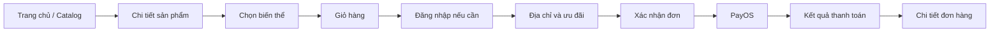

# Kế hoạch frontend storefront mini ecommerce

Ngày lập: 2026-09-18  
Trạng thái: sẵn sàng triển khai  
Tham chiếu sản phẩm: [Định hướng storefront](../biz/storefront.md)

## 1. Kết luận thiết kế

Thay giao diện test API một trang hiện tại bằng storefront React nhiều route, sáng, gọn và ưu tiên hình ảnh sản phẩm. Luồng chính là:



Mục tiêu trải nghiệm là khách hiểu sản phẩm và có thể thêm vào giỏ trong vài giây, không nhìn thấy các khái niệm `SKU #`, quyền truy cập, API URL hay webhook. Phần quản trị không nằm trong MVP storefront.

## 2. Hiện trạng và khoảng cách

| Hiện tại | Đích cần đạt |
|---|---|
| `App.tsx` chứa xác thực, catalog, giỏ, địa chỉ và checkout | Mỗi tác vụ có route và module rõ ràng |
| Người dùng phải đăng nhập trước khi xem sản phẩm | Catalog và chi tiết sản phẩm truy cập công khai |
| Sản phẩm hiển thị chữ cái thay cho ảnh | Gallery ảnh, ảnh dự phòng và tỉ lệ cố định |
| Chọn SKU qua danh sách kỹ thuật | Chọn biến thể theo nhãn như màu, bộ nhớ; giá/tồn kho cập nhật tức thì |
| Giỏ chỉ đọc, không đổi số lượng hoặc xóa | Drawer giỏ nhanh và trang giỏ đầy đủ |
| Checkout gộp trong dashboard | Checkout theo một trang tập trung, tóm tắt đơn luôn nhìn thấy |
| Token lưu nhưng chưa tự refresh | Phiên đăng nhập tự refresh và xử lý hết hạn thống nhất |
| CSS 1.112 dòng trong một file | Token, primitive và component styles có ranh giới rõ |
| Một cờ `busy` khóa toàn ứng dụng | Loading theo mutation/query, chỉ khóa đúng thao tác đang chạy |

## 3. Phong cách thị giác

### Hướng chọn

Phong cách “modern retail editorial”: nền trắng ấm, chữ than đậm, khoảng trắng rộng, hình sản phẩm là điểm nhấn. Màu thương hiệu xanh chàm dùng cho CTA và trạng thái chọn; màu cam chỉ dùng cho ưu đãi. Tránh hiệu ứng kính tối hiện tại vì làm cửa hàng giống dashboard kỹ thuật và giảm độ rõ của ảnh sản phẩm.

### Nền tảng thiết kế

- Font: `Be Vietnam Pro` cho toàn bộ UI; fallback `system-ui` để hiển thị nhanh.
- Khung nội dung: tối đa 1.280 px; gutter 16 px mobile, 24 px tablet, 32 px desktop.
- Lưới sản phẩm: 2 cột mobile, 3 cột tablet, 4 cột desktop.
- Bo góc: 8 px cho control, 12 px cho card, 16 px cho panel lớn, pill cho badge.
- Ảnh sản phẩm: nền trung tính, tỉ lệ 1:1, `object-fit: contain`; không để layout nhảy khi ảnh tải.
- Motion: 140–220 ms cho hover/drawer/toast; tôn trọng `prefers-reduced-motion`.
- Shadow nhẹ, chỉ thể hiện lớp nổi; không dùng glow.

### Token ngữ nghĩa ban đầu

| Nhóm | Vai trò |
|---|---|
| Brand | `primary`, `primary-hover`, `on-primary` |
| Surface | `canvas`, `surface`, `surface-muted`, `surface-raised` |
| Text | `text`, `text-subtle`, `text-muted`, `text-inverse` |
| Feedback | `success`, `warning`, `danger`, `info` và surface tương ứng |
| Border | `border`, `border-strong`, `focus-ring` |
| Layout | spacing theo thang 4 px, radius, shadow, breakpoint, z-index, duration |

Mọi màu, khoảng cách, radius, shadow và thời gian chuyển động được khai báo một lần trong lớp token của `frontend/src/style.css`. Component behavior nằm trong TSX; chưa cần thêm Tailwind cho codebase mini hiện tại.

## 4. Kiến trúc thông tin và route

| Route | Mục đích | Truy cập |
|---|---|---|
| `/` | Trang chủ: hero ngắn, danh mục, sản phẩm mới/nổi bật, lợi ích mua hàng | Công khai |
| `/products` | Catalog, tìm kiếm, lọc danh mục/brand/giá, sắp xếp, phân trang | Công khai |
| `/products/:id` | Gallery, giá, biến thể, tồn kho, mô tả, đánh giá | Công khai |
| `/cart` | Sửa số lượng, xóa sản phẩm, nhập coupon, xem tổng tiền | Khách hoặc đã đăng nhập |
| `/checkout` | Địa chỉ, tóm tắt đơn, coupon và tạo thanh toán | Bắt buộc đăng nhập |
| `/payment/success` | Đang xác minh rồi hiển thị kết quả thanh toán | Đã đăng nhập |
| `/payment/cancel` | Thanh toán bị hủy và CTA quay lại checkout/đơn | Đã đăng nhập |
| `/login` | Đăng nhập; quay về route người dùng đang làm dở | Công khai |
| `/register` | Tạo tài khoản | Công khai |
| `/verify-email` | Nhập OTP, gửi lại mã có bộ đếm | Công khai |
| `/forgot-password`, `/reset-password` | Khôi phục mật khẩu | Công khai |
| `/account` | Hồ sơ và điều hướng khu vực tài khoản | Đã đăng nhập |
| `/account/orders` | Danh sách đơn, lọc trạng thái cơ bản | Đã đăng nhập |
| `/account/orders/:id` | Timeline trạng thái, sản phẩm, thanh toán, hủy/đánh giá | Đã đăng nhập |
| `/account/addresses` | Thêm, sửa, xóa, đặt mặc định | Đã đăng nhập |
| `/account/security` | Đổi mật khẩu, 2FA | Đã đăng nhập |
| `*` | Trang không tìm thấy với lối quay lại catalog | Công khai |

Header desktop gồm logo, tìm kiếm lớn, danh mục, tài khoản và giỏ. Mobile dùng header hai hàng, filter dạng bottom sheet và thanh hành động cố định ở chi tiết sản phẩm. Footer chỉ giữ liên kết hỗ trợ và chính sách cần thiết.

## 5. Luồng UX quan trọng

### Khám phá sản phẩm

1. Trang chủ cho thấy sản phẩm ngay trong màn hình đầu, không dùng hero chiếm hết chiều cao.
2. Tìm kiếm có debounce, đồng bộ vào URL để back/forward và chia sẻ vẫn đúng trạng thái.
3. Filter đang áp dụng hiển thị bằng chip và có “Xóa tất cả”. Mobile mở bottom sheet, chỉ áp dụng khi bấm CTA.
4. Product card cho thấy ảnh, tên, giá bán, giá gạch, phần trăm giảm và trạng thái hết hàng. Card không chứa quá nhiều nút.
5. Phân trang dùng URL; skeleton giữ nguyên kích thước card để tránh layout shift.

### Chi tiết và chọn biến thể

1. Biến thể được nhóm theo tên người dùng hiểu: `Màu sắc`, `Dung lượng`, `Bộ nhớ`.
2. Tổ hợp không tồn tại hoặc hết hàng bị vô hiệu hóa nhưng vẫn giải thích được lý do.
3. Giá, tồn kho và CTA đổi theo SKU đã chọn; chưa chọn đủ thì CTA chỉ rõ còn thiếu lựa chọn nào.
4. Sau khi thêm, mở mini-cart/drawer với hai lựa chọn rõ: tiếp tục mua hoặc xem giỏ.
5. Reviews có điểm trung bình, phân bố sao, phân trang và ảnh; form đánh giá chỉ xuất hiện cho đơn hợp lệ.

### Giỏ và checkout

1. Cho phép sửa số lượng và xóa tại chỗ; cập nhật lạc quan nhưng rollback kèm thông báo nếu API lỗi.
2. Tổng tiền luôn do backend trả về; frontend không tự quyết định giá hoặc giảm giá.
3. Checkout chọn địa chỉ có sẵn trước, “Thêm địa chỉ” mở dialog gọn. Địa chỉ mặc định được chọn sẵn.
4. Filter catalog hỗ trợ danh mục, thương hiệu và khoảng giá; trạng thái filter nằm trong URL để back/forward vẫn đúng.
5. Coupon được kiểm tra khi tạo đơn theo API hiện tại; lỗi coupon hiển thị ngay cạnh trường và không xóa dữ liệu đã nhập.
5. Tạo đơn và tạo payment là hai mutation có trạng thái riêng. Không tạo lặp đơn khi double-click.
6. Trang success không tuyên bố “đã thanh toán” chỉ dựa vào redirect; cần đọc lại trạng thái đơn/payment rồi mới kết luận.

### Xác thực

1. Chỉ chặn tại checkout hoặc khu vực tài khoản; sau login quay lại đúng route trước đó.
2. Hỗ trợ đầy đủ login thường, login 2FA/TOTP, recovery code, verify email và quên mật khẩu.
3. Refresh token chạy một lần khi gặp 401, sau đó phát lại request; thất bại mới xóa phiên và chuyển login.
4. Mỗi form giữ lỗi cạnh field, focus field lỗi đầu tiên và có thông báo tổng quát ngắn.

## 6. Trạng thái bắt buộc cho từng màn hình

Mỗi page/section phải được thiết kế đủ sáu trạng thái: loading, empty, partial, full, error và success.

| Khu vực | Empty | Error/khôi phục |
|---|---|---|
| Catalog | “Chưa tìm thấy sản phẩm phù hợp” + xóa bộ lọc | Retry, giữ nguyên search/filter |
| Giỏ | Minh họa nhỏ + CTA “Khám phá sản phẩm” | Retry từng dòng hoặc tải lại giỏ |
| Địa chỉ | Giải thích cần địa chỉ để giao hàng + CTA thêm | Giữ nội dung form, cho gửi lại |
| Đơn hàng | CTA quay lại mua sắm | Retry; không làm mất filter/trang |
| Reviews | “Chưa có đánh giá” + lời mời sau mua | Retry phần reviews, không chặn thông tin sản phẩm |
| Ảnh | Placeholder theo tỉ lệ cố định | Ảnh dự phòng, không hiện icon ảnh vỡ |

Toast chỉ dùng cho kết quả toàn cục. Lỗi người dùng có thể sửa phải nằm cạnh control liên quan. Các thao tác dài có label động như “Đang tạo đơn…”, không chỉ dùng spinner.

## 7. Cấu trúc frontend đề xuất

```text
frontend/src/
  app/
    router.tsx
    providers.tsx
  assets/
  components/
    ui/               # Button, Input, Dialog, Drawer, Skeleton, Toast
    commerce/         # ProductCard, Price, VariantPicker, CartLine
    layout/           # StoreHeader, MobileNav, StoreFooter
  features/
    auth/
    catalog/
    cart/
    checkout/
    account/
    reviews/
  pages/
  services/
    api-client.ts
    query-keys.ts
  style.css         # design tokens + global layout styles
  review.css        # review form styles
  types/
```

Nguyên tắc ranh giới:

- `components/ui` chỉ trình bày, không fetch dữ liệu.
- Component trong `features` sở hữu hành vi của một miền; request tập trung trong service/hook của feature.
- Server state dùng TanStack Query; state UI cục bộ dùng `useState`/`useReducer`.
- Chỉ thêm Zustand nếu giỏ khách chưa đăng nhập cần đồng bộ phức tạp; không thêm store toàn cục từ đầu.
- Kiểu response được khai báo theo DTO backend hoặc sinh từ OpenAPI khi contract đã ổn định.

Dependency đã dùng: `react-router-dom`, `@tanstack/react-query`, `react-hook-form`, `zod`, `@hookform/resolvers`, `lucide-react`; quality gates dùng ESLint flat config và Prettier. Visual tokens nằm trong CSS variables tập trung.

## 8. Component và contract UI

### Primitive cần xây trước

- `Button`: `primary | secondary | ghost | danger`, size `sm | md | lg`, có loading.
- `TextField`, `PasswordField`, `Select`, `Checkbox`: label, hint, error, `aria-describedby` thống nhất.
- `Dialog`, `Drawer`, `BottomSheet`: focus trap, đóng bằng Escape, trả focus về trigger.
- `Toast`, `InlineAlert`, `Skeleton`, `EmptyState`, `Pagination`.
- `VisuallyHidden` và `Spinner` có nhãn cho screen reader.

### Component commerce

- `Money` dùng `Intl.NumberFormat('vi-VN', { currency: 'VND' })`.
- `ProductCard`, `ProductGallery`, `PriceBlock`, `DiscountBadge`.
- `VariantPicker`, `QuantityStepper`, `StockStatus`.
- `CartLine`, `CartSummary`, `AddressCard`, `OrderStatus`, `OrderTimeline`.
- `RatingSummary`, `RatingStars`, `ReviewCard`, `ReviewForm`.

Chỉ tách component khi có ranh giới hành vi rõ hoặc đã xuất hiện mẫu lặp. Không tạo component cho từng wrapper nhỏ.

## 9. API và backend cần chốt trước

### Blocker cho storefront chuẩn

Các route đọc `GET /products`, `GET /products/:id`, `GET /products/:id/skus`, `GET /categories`, `GET /brands` và reviews hiện đi qua global authentication; sản phẩm/danh mục/brand còn yêu cầu permission. Cần cho phép đọc công khai trước khi hoàn thiện catalog. Nếu giữ như hiện tại, storefront buộc khách đăng nhập trước khi xem hàng, đi ngược định hướng sản phẩm.

### Contract cần xác minh hoặc bổ sung

- Product list/detail trả đủ media, brand, category, giá gạch/giá bán và thông tin tổng hợp đánh giá.
- Product detail trả mapping biến thể → SKU để picker vô hiệu hóa tổ hợp không hợp lệ.
- Có endpoint đọc trạng thái payment/order sau redirect PayOS.
- Xác định giỏ guest: MVP đơn giản có thể lưu local và merge sau login; nếu chưa làm backend merge, yêu cầu login khi bấm “Thêm vào giỏ” là phương án tạm thời nhưng giảm chuyển đổi.
- Response phân trang dùng một shape thống nhất: `items`, `page`, `limit`, `total`, `totalPages`.
- Media URL có ảnh thumbnail phù hợp; frontend không tải ảnh gốc cho product card.
- CORS và redirect URL cho môi trường dev/production được cấu hình theo origin frontend.

## 10. Khả năng truy cập, responsive và chất lượng

- Tương phản WCAG AA; focus ring luôn thấy bằng bàn phím.
- Mọi control có accessible name; icon-only button có `aria-label`.
- Target chạm tối thiểu 44 × 44 px; không phụ thuộc hover để lộ thao tác chính.
- Dialog/drawer khóa scroll đúng cách, trap focus và hỗ trợ Escape.
- Breakpoint kiểm tra tối thiểu: 360, 390, 768, 1024, 1280 và 1440 px.
- Không có horizontal scroll ở 320 px; nội dung dài và tiếng Việt có dấu không phá layout.
- Mục tiêu hiệu năng: LCP dưới 2,5 giây, CLS dưới 0,1, INP dưới 200 ms trên dữ liệu production hợp lý.
- Lazy-load route ngoài màn hình đầu; ảnh dưới fold dùng lazy loading, có `width`/`height` cố định.

## 11. Lộ trình triển khai

### Chặng 0 — contract và nền móng (0,5–1 ngày)

- Chốt public read APIs và response shape.
- Cài router, query provider, error boundary và cấu trúc thư mục.
- Tách API client: refresh token, retry có kiểm soát, AbortSignal, lỗi chuẩn hóa.
- Tạo token, global styles và các primitive quan trọng.

**Hoàn tất khi:** app có route shell responsive, theme token duy nhất, API client xử lý 401 và error boundary hoạt động.

### Chặng 1 — catalog mua sắm (2–3 ngày)

- Trang chủ, catalog, search/filter/sort/pagination theo URL.
- Product card, skeleton, empty/error states.
- Chi tiết sản phẩm, gallery, variant picker, reviews read-only.

**Hoàn tất khi:** người chưa đăng nhập duyệt và chọn đúng SKU trên mobile/desktop.

### Chặng 2 — auth và giỏ hàng (2–3 ngày)

- Login/register/verify/forgot/reset và 2FA.
- Route guard có return URL.
- Mini-cart, trang cart, thay số lượng, xóa và xử lý stock conflict.

**Hoàn tất khi:** phiên được refresh an toàn trong luồng sử dụng và giỏ không sai tổng tiền sau mutation.

### Chặng 3 — checkout và đơn hàng (2–3 ngày)

- Quản lý địa chỉ, coupon, tạo đơn và PayOS redirect.
- Trang success/cancel xác minh trạng thái thực.
- Danh sách, chi tiết, hủy đơn và timeline trạng thái.

**Hoàn tất khi:** chạy end-to-end từ catalog đến đơn đã thanh toán/hủy mà không cần thao tác kỹ thuật.

### Chặng 4 — đánh giá và hardening (1–2 ngày)

- Tạo/sửa/xóa review, upload media.
- Accessibility pass, responsive pass, error/offline cases.
- Lazy loading, image sizing, bundle check và browser QA.

**Hoàn tất khi:** build sạch, luồng bàn phím dùng được, các trạng thái failure có đường khôi phục.

Tổng ước lượng: 8–12 ngày làm việc cho một người khi backend contract được chốt sớm. Nếu chỉ cần demo học tập, có thể dừng sau chặng 3 với khoảng 6–9 ngày.

## 12. Kiểm thử và tiêu chí nghiệm thu

Ưu tiên test hành vi có rủi ro thay vì test markup:

- Unit: tính SKU hợp lệ từ tổ hợp biến thể, format tiền, normalize API error.
- Component: variant picker, quantity stepper, form error/focus, dialog keyboard.
- Integration: filter đồng bộ URL, 401 → refresh → retry, cart mutation rollback.
- E2E: đăng ký/xác thực; login 2FA; tìm sản phẩm → giỏ → địa chỉ → đơn → PayOS; cancel payment; xem/hủy đơn; review sau giao hàng.

Definition of Done cho mỗi màn hình:

- Đủ loading/empty/error/success và retry.
- Dùng được ở 360 px và desktop, không layout shift rõ rệt.
- Bàn phím thao tác được, focus order hợp lý, không lỗi accessibility nghiêm trọng.
- Không có giá trị thị giác hardcode ngoài token source.
- Request bị hủy khi rời màn hình; không cập nhật state sau unmount.
- Không lộ thuật ngữ backend trong nội dung người dùng thấy.

## 13. Ngoài phạm vi MVP

- Dashboard admin/seller, quản lý kho và promotion CRUD.
- Wishlist, so sánh sản phẩm, chat, gợi ý cá nhân hóa.
- Đăng nhập mạng xã hội, đa tiền tệ, đa ngôn ngữ UI.
- SSR/SEO nâng cao. Vite SPA đủ cho bản mini; nếu mục tiêu chuyển sang bán hàng thật và cần organic search, đánh giá chuyển storefront sang framework SSR ở một kế hoạch riêng.

## 14. Thứ tự bắt đầu đề xuất

Vertical slice `/products` → `/products/:id` → thêm một SKU vào `/cart` đã được dựng cùng auth, checkout và account. `App.tsx` hiện chỉ giữ provider/router; page, feature, layout và component dùng chung nằm ở các module riêng để tiếp tục mở rộng mà không dồn logic vào một file.
